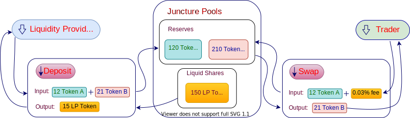

Juncture is an automated market maker powered by a constant product formula and implemented in a system of non-upgradeable smart contracts on the Huobi ECO Chain. It obviates the need for trusted intermediaries, prioritizing decentralization, censorship resistance, and security. Junctue is a forked-uniswap so it is open-source software licensed under the GPL.
