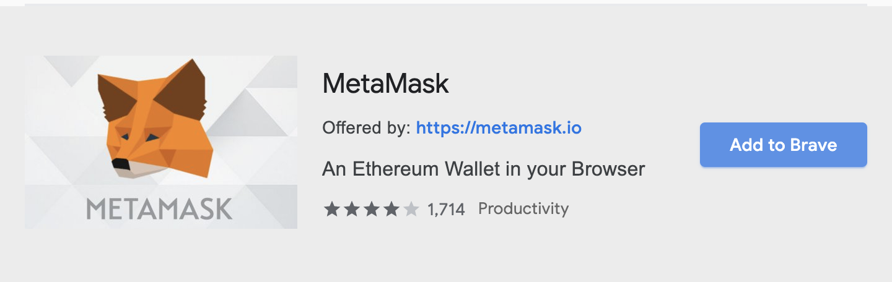
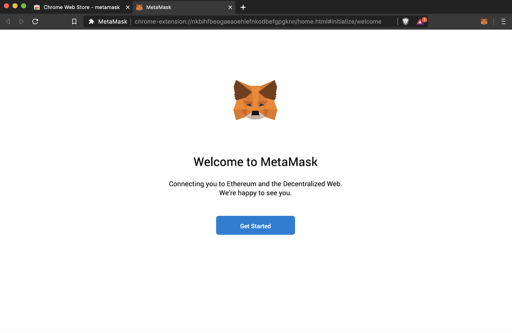
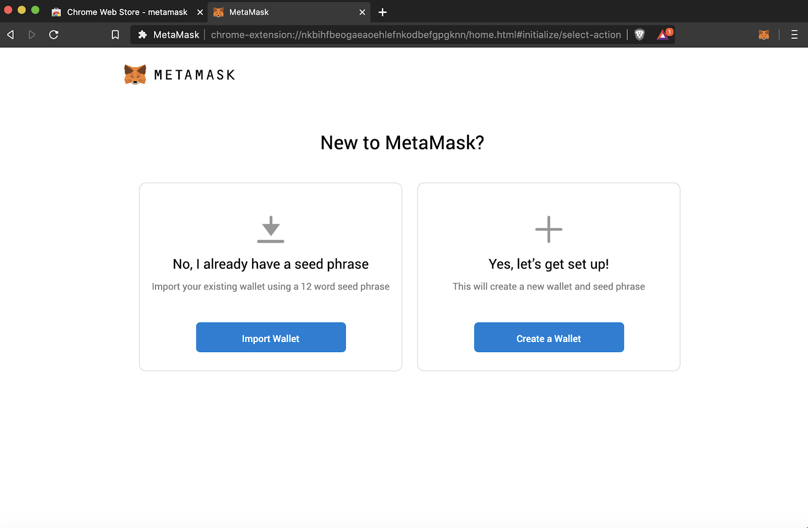
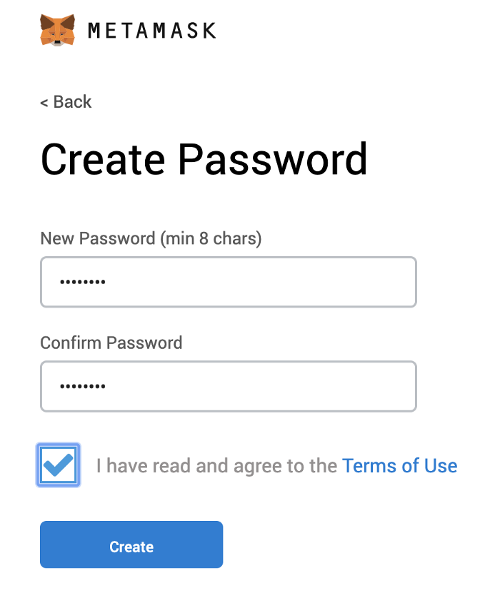
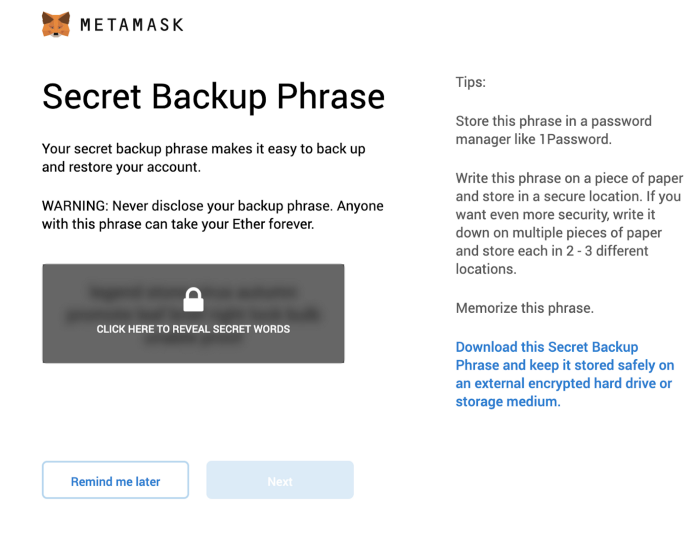
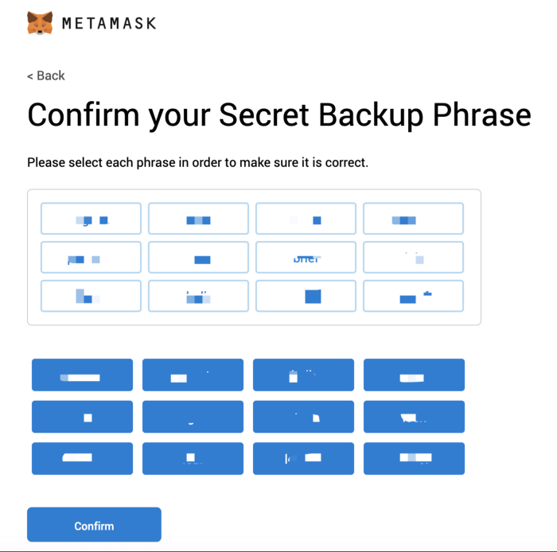
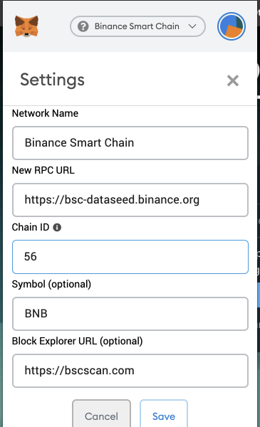
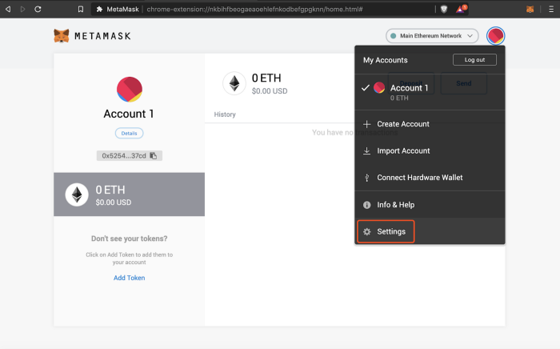
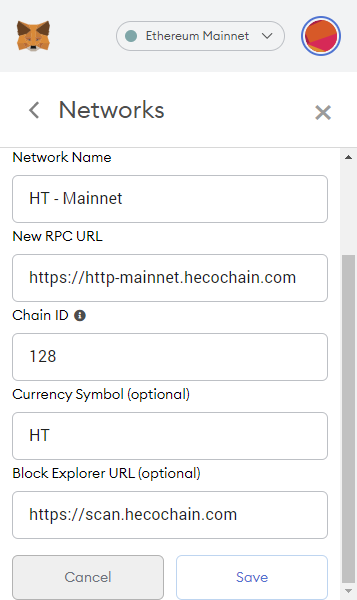

### How to connect to Huobi ECO Chain(HECO) and Binance Smart Chain(BSC) through MetaMask
MetaMask was created out of the needs of creating more secure and usable Ethereum-based web sites. In particular, it handles account management and connecting the user to the blockchain. It’s supported in Chrome, Brave, and Safari browsers.

#### Install

Example: Install MetaMask in Brave browser

Open Extension Category in Brave: https://chrome.google.com/webstore/category/extensionsSearch for MetaMask

Warning

Note: Make sure it’s offered by metamask.io

Click on “Add to Brave”

That’s it! You have successfully installed MetaMask extension in Brave!

#### Create an account in MetaMask

1. Click on the “Create a wallet” button

2. Create Password of at least 8 characters

Click on “Create” and then write down your backup phrase.

Select each phrase in order to make sure it is correct then click “Confirm”.

Congratulations! you have create your MetaMask account!

##### Connect Your MetaMask With Binance Smart Chain

1. Go to setting page

2. Add a new network

>Mainnet
>
>-Network name: Binance Smart Chain
>
>-New RPC URL: https://bsc-dataseed.binance.org
>
>-ChainID: 56
>
>-Symbol: BNB
>
>-Block Explorer URL: https://bscscan.com

##### Connect Your MetaMask With Huobi ECO Chain

1. Go to setting page

2. Add a new network

>-Network name: HT- Mainnet
>
>-RPC URL: https://http-mainnet.hecochain.com
>
>-Chain ID: 128
>
>-Symbol: HT
>
>-Block Explorer: https://scan.hecochain.com